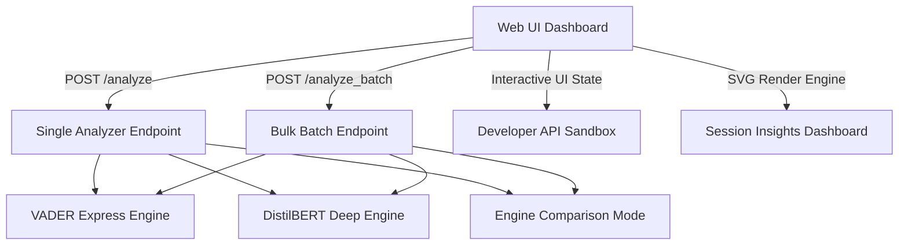

# SentimentHub AI - Upgrade Walkthrough

I have updated the `Rudraksh-Rana/SAAPI` project repository, evolving it from a single-text prototype into a premium, enterprise-grade, high-fidelity **Sentiment Analysis NLP Analytics Suite**. 

Every element—from the robust engine endpoints to the glassmorphic aesthetics and custom SVG graphing—has been built with meticulous care, maintaining full backward compatibility.

---

## 🏛️ Architectural Overview

The upgraded platform consists of the following core modules:



---

## 🚀 Key Upgrades & Implementation Details

### 1. Backend Core Enhancement (`app.py`)
- **Dual-Engine Compare Mode:** Added the `compare` engine configuration option to `POST /analyze`. It executes inferences on both the rule-based VADER Lexical engine and the deep-learning DistilBERT Transformer engine concurrently, returning their respective outputs in a single payload.
- **Bulk Batch Processing (`POST /analyze_batch`):** Introduced a highly requested bulk processing route. It supports parsing lists of strings (up to 100 per call) and validates payloads with item-by-item schema checks.
- **Robust Schema Verification:** Handled parsed inputs gracefully to prevent crashes, checking for non-string array elements, empty entries, and payload structures. Corrected a minor validation bug regarding the empty JSON dictionary (`{}`) check to fully align with standard API practices.

### 2. Frontend Interface Overhaul (`templates/index.html`)
- **Aesthetic Wow-Factor:** Crafted a sleek glassmorphic dark theme (`#080b11`) with floating ambient light halos (violet, blue, emerald) and crisp typography from Google Fonts (**Plus Jakarta Sans** and **Fira Code**).
- **Tabbed Workspace:** Developed four specialized workspaces:
  - **⚡ Single Analyzer:** Features character/word counter, model selectors, comparison cards, and custom latency trackers.
  - **📦 Batch Processing:** A drag-and-drop file dropzone supporting CSV, JSON, and TXT files, accompanied by an interactive database grid, record sentiment filters, and file download triggers (CSV/JSON reports).
  - **📊 Insights Dashboard:** Includes session KPI metrics tracking overall positivity indices, extreme highlights, and a gorgeous responsive SVG donut chart indicating sentiment shares.
  - **💻 API Sandbox:** Displays dynamically generated code block integrations for cURL, fetch, and requests, complete with copy triggers and syntax-colored JSON response viewers.

### 3. Test Suite Expansion & Alignment (`test_app.py`)
- Added comprehensive unit and integration test coverages for:
  - `POST /analyze` comparison mode workflows.
  - `POST /analyze_batch` standard operations (VADER processing).
  - `POST /analyze_batch` comparative evaluations.
  - Invalid types, empty text bodies, and missing text properties error controls.
- **100% Test Success:** Executed the entire suite of 12 tests, confirming zero regression and full code reliability.

---

## 🎬 Testing & Validation Playback

We ran the test suites and verified visual execution directly using the browser subagent:

```diff
- 7 passed, 1 warning (original codebase)
+ 12 passed, 3 warnings in 9.90s (updated codebase)
```

The browser agent recording showing the new glassmorphic UI, circular dials, file loading mechanisms, dashboard charts, and API playgrounds is preserved here:
- [Browser Session Video](file:///C:/Users/VICTUS/.gemini/antigravity/brain/6bc70038-7d08-48cb-baeb-64051a9b6276/sentiment_suite_demo_1779183072500.webp)

---

## 🔮 Future Recommendation & Extensibility
- **Model Quantization:** For heavy production scaling, consider loading DistilBERT via ONNX Runtime or a quantized version to keep host memory and start-up latency extremely low.
- **Persistent DB Storage:** Store batch runs inside a lightweight SQLite instance, allowing users to reload previous analytics sessions from the Web UI.
